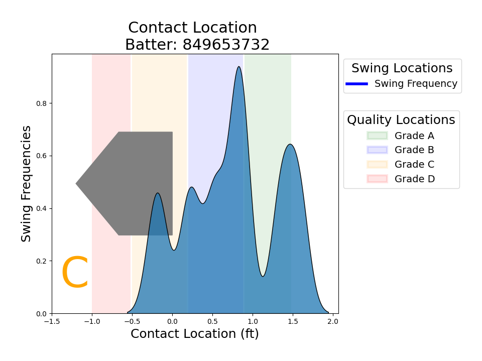
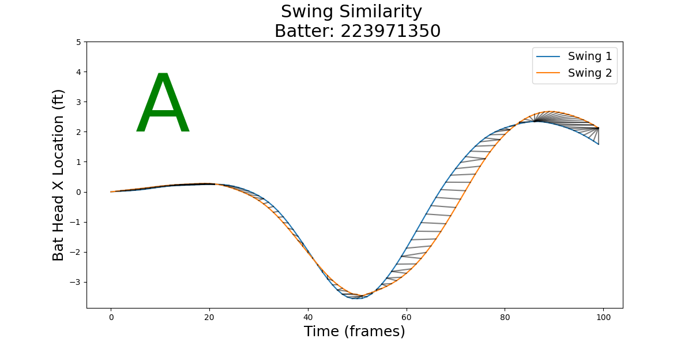

## Metrics

### Hunting Score
The hunting score evaluates how picky a batter is in their swing selection when they have no or one strike. Batters must be selective in the swings that they take.[^1] Batters must identify a quality pitch and swing in a fraction of a second, leaving little time to put a quality swing on any pitch anywhere in the strike zone. Instead, with less than two strikes, batters should be selective in their swing selection. They should be hunting for a pitch to hit hard.

**Technical Details:**
The frame listed as "nearest" or "hit" in the bat tracking data set the contact time. The frame closest to this contact time in the ball tracking data is the pitch location. The distance between each point and the geometric median (the point with the smallest euclidean distance to every other point) is calculated in the x-z plane. Each swing is assigned a score by mapping the pitches distance from the geometric mean to the grade provided in the scouting tool. The calculations exclude all pitches thrown when the batter has two strikes in the at-bat.

**Limitations:**
The hunting score does not consider any pitch that the batter did not swing at. Therefore, the hunting score only evaluates when the batter decides to swing and can only penalize the batter for bad decisions; it cannot provide any reward to a batter that does not swing at bad or sub-optimal pitches.

This evaluation oversimplifies the idea of hunting for a pitch. The best pitch to hit can often depend on the strike count, the pitcher, and how the pitcher performs on any given day. The data provided does include the strike count but does not include details about the pitcher or the pitch type. 

**Visualization:**
The visual shows the locations of all pitches the batter swung at during the three-game series. Colors indicate the pitch's outcome, and shapes show the two-strike pitches. This first example shows a player hunting for a high, inside pitch. This batter only swung at pitches in the zone for neutral and positive-count pitches, and the other swings showed this batter protecting the plate with two strikes. 

The second example shows a less picky batter willing to swing at pitches in a more extensive range of the strike zone. This batter also swings at high and inside pitches and a low pitch on the outer third of the plate. 

Even these two images show that hunting only sometimes leads to success. In this series, the batter with the higher hunting score never safely reached base, while the batter with the lower hunting score did.

### Contact Location Score
Quality contact requires excellent timing during the at-bat. Good timing includes many components of the swing; this analysis focuses on one of those aspects: contact location. The contact location often correlates with the launch angle, indicating ground balls, line drives, or home runs.[^3] 

**Technical Details:**
Scoring a batter's timing with this approach only considers the contact location, which leaves out essential components such as pitch location and contact quality. The contact location is determined by finding the average head_pos_1 and handle_pos_1 values in the row labeled "Hit" or "Nearest" in the bat tracking data. Three sections around the plate were assigned score values; each at-bat received a score. The final score for each batter is the sum of all timing scores divided by the number of swings given a score.

**Limitations:**
The contact zones are set assuming a fastball is down the middle; other pitch types and locations may have different quality contact zones. The batters' power, flexibility, and comfort level may also alter the best places for contact. The assignment of contact location grades also assumes that home runs are better than line drives and that line drives are better than grounders. This assumption may only be correct for some batters or may not be the goal for all teams. 

This assessment of contact zones also assumes batters have similar stances within the batter's box. A more robust analysis could consider the batter's starting location and evaluate the contact location relative to the batter's location instead of relative to the plate. 

**Visualization:**
The visualization of the contact zone shows the plate from above with the distribution of the contact locations overlaid across the home run, line drive, and ground ball regions. The first example shows a batter whose contact locations are primarily in the line drive zone, with another group of contacts in the home run zone. 

In the second example, the batter usually makes contact in front of the home run zone. Since no value is assigned to contact in front of the home run zone, this batter is heavily penalized for his contact location and receives a lower grade. 

### Tracking Angle
The tracking angle score is a combination of attack angle and pitch angle. A positive attack angle increases the opportunity for the batter to make contact with the pitch.[^4] The article illustrates that with this image: 

This article about attack angle assumes the pitch angle is between 6 and 10 degrees. Since the provided data includes bat tracking and ball tracking data, this analysis compares the attack and pitch angles to create a new metric: the tracking angle. This metric will better indicate how the batter is tracking the ball as it approaches the plate and how he swings the bat through the pitch angle. 

**Technical Details:**
Attack angle measures the angle the bat takes as it approaches contact with the pitch. The track angle compares the pitch angle and the attack angle. The attack angle is calculated from the swing trough to the contact point, and the pitch angle is calculated as the change from the frame before contact to the frame of contact. Track angle is the difference between pitch angle and attack angle, such that a negative track angle indicates a swing that has not gotten low enough to meet the angle of the pitch. In contrast, a positive track angle indicates an uppercut swing that drives up through the pitch. The scores are set by creating a list of angle ranges and assigning each swing's tracking angle to a range. The final score is the mode of each batter's swing scores.

**Visualization:**
The tracking angle visual shows the tracking angle ranges shaded to indicate the proportion of the batter's swings in that range. The batter swing moves from the right edge of the shaded area to the center contact point. The line of balls sets a reference for the pitch, and the matching tracking angle is highlighted with a magenta outline. Sections below the pitch show uppercut swings that cut up through the angle of the pitch, and sections above the pitch show slicing swings that hack down through the angle of the pitch. 

The first example shows a batter who consistently swings the bat through the plane of the ball. Most of his swings match the pitch angle, with a few swings hacking down across the pitch angle. 

The second example shows a batter who most often does not meet the pitch on the plane. Instead, this batter's attack angle is usually lower than the pitch angle. Because of this difference in tracking angle, this batter will need to have even better timing than the first batter to contact the pitch.

### Similarity Score
> Note: The batting tool will not include the similarity score. Generating the score and the visuals for the score required access to the raw bat tracking data, which cannot be shared in the public repo used to deploy the tool.

Similarity score evaluates how consistent a player is with each of their swings. Efficient and repeatable swing mechanics are a critical part of good batting.[^2] Check swings, [swords](https://www.mlb.com/glossary/statcast/sword), and hacks at bad pitches are all indications that a pitch fooled a batter. These swings have lower chances of becoming quality hits than those with good, consistent mechanics. Evaluating swing consistency can provide scouts with information that can be difficult to collect through visual review. 

**Technical Details:**
The path of each swing is compared to a reference swing (the first swing by a batter in the dataset). The similarity of each swing is calculated using dynamic time warping (DTW). DTW is useful for comparing time series data because it allows for stretching and compressing the time component when determining the similarity of the path. Swings were normalized by taking 75 frames before and 75 frames after contact and subtracting each frame from the starting frame. The normalization provided a baseline swing location, so the batter changing their location in the box did not impact similarity. Also, any swing starting from the left side of the catcher was mirrored to the right side of the catcher, which allows for a direct comparison of all swings of switch hitters The similarity of each swing component (x, y, and z axes for the handle and head of the bat) was evaluated separately and combined to generate a single similarity measure for each swing. The swing similarity grade is determined by finding the percent of swings over two standard deviations from the mean in the batter's similarity scores sample.

**Limitations:**
This implementation of swing similarity does not include any considerations for pitch location or type. With bat tracking data for only three games, many batters would be dropped from the analysis if swing similarity could only be determined for similar pitches. If an entire season of hitting was analyzed, this analysis could be updated to adjust for pitch locations. Due to this limitation, the hunting grade and the similarity grade may both indicate a batter who is not being picky in their swing selection.

Bunts will also penalize batters in this metric. The bat movement in a bunt it clearly different than a swing, but bunts have not been removed from the analysis.

**Visualization:**
The visual shows a batter's reference swing and their least similar swing. It depicts the bat head movement across a single axis over time. The idea of mapping a swing (which is a three dimensional movement) onto a single dimension over time may be difficult to conceptualize. The following is an animation to help interpret the swing similarity visuals. In this animation, the small window pictures a swing from directly above the batter. The blue box at the bottom of this window traces the swing movement against a single axis. The blue box is transposed onto the large y-axis as the curve is drawn one frame at a time, showing the single-axis movement over time.

This first example shows two swings moving against the x-axis. The bat head starts slowly, then quickly travels out across the plate, and eventually travels back across the plate as the batter finishes the swing, wrapping the bat head back behind his body. This batter has very consistent swings; both follow nearly the same path along the axis during the swing.

Here is an example of a less consistent batter. This batter has one swing that reaches out across the plate and then wraps back, while the other swing doesn't reach out as far and never returns to a position behind the batter. 

## Footnotes
[^1]: American Baseball Camps. (2022, April 4) Hitting in Advantaged Counts. https://americanbaseballcamps.com/courses/developing-a-hitting-approach-how-to-have-a-plan-on-every-pitch/lessons/advantage-counts/
[^2]: Brooks, Mark. (2022, November). The Art of Batting in Baseball. https://appliedvisionbaseball.com/the-art-of-batting-in-baseball/
[^3]: Hammit, Brock. (2019, February 9). Using Point of Impact to Measure Timing. https://medium.com/@hammit21/using-point-of-impact-to-measure-timing-b79ca6958221
[^4]: Shirazi, Bahram. (2018, November 19). Attack Angle, Baseball's Step-Child Metric. https://rocklandpeakperformance.com/attack-angle-baseball-step-child-metric/