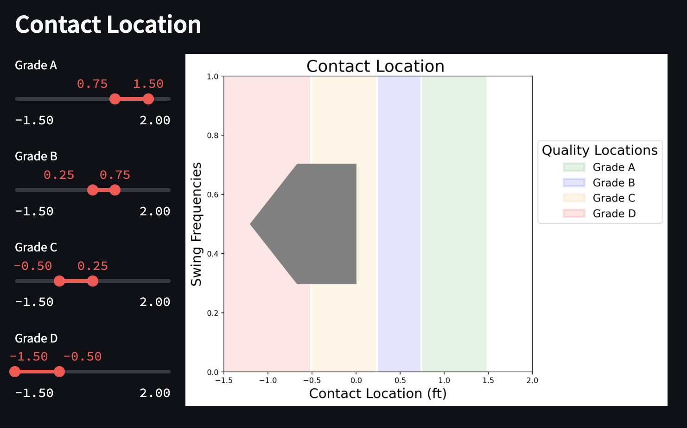

## Customization Tool
The swing metrics [dashboard](https://wisd2024-swing-metric-dashboard.streamlit.app/) allows scouts to customize the grades for each of the metrics. They can set the acceptable quality contact locations, pitch hunting radius, and tracking angle ranges. In addition to updating the grades, the user can change the ranking of the batters by selecting the prefered priority for each of the metrics. The tool will provide a list of all the batters with a sufficient number of swings and show the grades for each of the metrics. The user can then select a batter to view the visuals for each of their metrics. 

### Navigation
The tool is navigated with radio buttons in the sidebar. The first tab is the Custom Grading page. When switching to the Scorecard tab the metric priority and swing count widgets will become available in the side bar. Similarly, the batter selection dropdown becomes avaiable in the side bar on the Batter Plots tab.

### Set Custom Grading Ranges
The first section in the tool allows the user to set the custom grading ranges. 

**Contact Location:**
The contact location grading ranges are defaulted to the ranges correlating with home runs, line drives, and grounders.[^3] The sliders can be moved to set the target locations. All contact locations between Grade A and B are assigned a score of 4 points, between Grade B and C get 3 points, between Grade C and D get 2 points, and all other locations are given 0 points. The final grade of the batter is average of all the swing scores. When setting the sliders, the Grade A value should be the highest and each subsequent grade should be lower than the previous to avoid errors.

**Pitch Hunting Radius:**
Similar to the contact location grading ranges, the hunting ranges are set using a slider and assigned a score based on the assigned grade. Swings less than the distance for Grade A are awarded 4 points, between Grade A and B get 3 point, between Grade B and C get 2 points, and between Grade C and D get 1 point. The final hunting grade is also the average of all the swing scores. When setting the sliders, the Grade A value should be the lowest and each subsequent grade should be higher than the previous to avoid errors.

**Tracking Angle Ranges:**
The tracking angle tool allows the user to select from a set of preset angle widths. These widths determine the range above and below the pitch that is assigned a particular score. For example, if Grade A is set to 2.5 and Grade B is set to 5 then swings within 2.5 degrees of the pitch angle (above or below) will be awarded 4 points, and swings between 2.5 and 7.5 degrees of the pitch angle (above or below) will be assigned 3 points. This continues with Grade C receiving 2 points and Grade D receiving 1 point. As with the contact location and pitch hunting, the average of all the swing scores gives the final tracking angle grade. There is no risk of errors when setting these values, but the user should consider that smaller values will leave more swings outside of the graded ranges, resulting in no points awarded for those swings and lower overall grades.

### Set Grading Priorities and Minimum Swing Count
After setting all of the grading values, the user is provided the opportunity to change the priority order of the metrics for ranking the batters and to restrict the batter list to only batters with a minimum number of swings. The order of the metrics should reflect the most important values to the user. A scout that wants patient players who only swing at pitches they can hit should prioritize pitch hunting, while a scout that wants players with home run swings should prioritize contact location. The swing count minimum allows the user to set a base of how many swings each batter must have. Larger numbers of swings will reduce the variability in scores. 

### Batter Scorecard
The ranked batter scorecard displays the list of batters and their scores on each metrics. The order of the batters is determined by the priorities set by the user. 

### Batter Selection and Visualization
Finally, in the Batter Plots tab, the user selects a batter from the ordered list to display the metrics visuals. This allows the user to verify the performance of the selected batter. 

## Footnotes
[^3]: Hammit, Brock. (2019, February 9). Using Point of Impact to Measure Timing. https://medium.com/@hammit21/using-point-of-impact-to-measure-timing-b79ca6958221